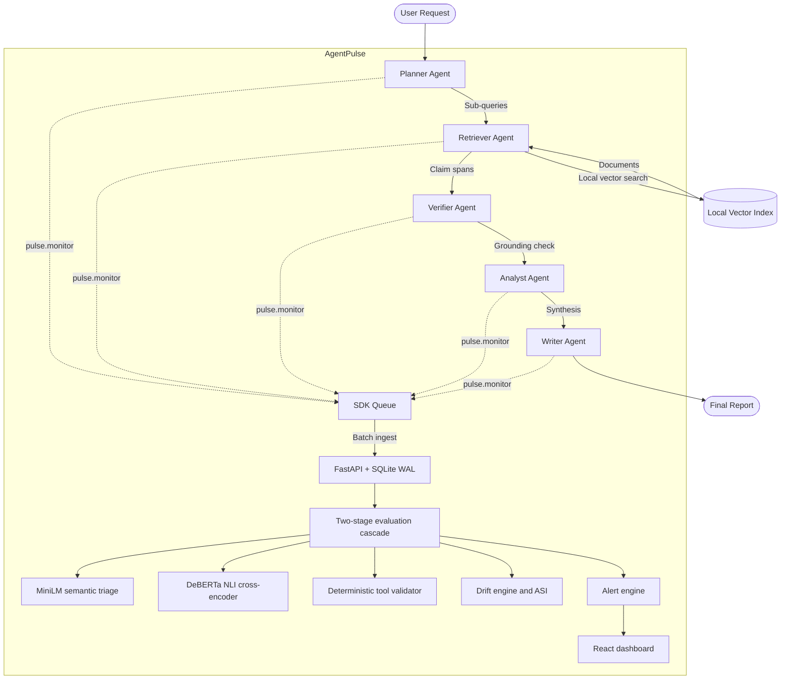

# AgentPulse: Master Product and Engineering Report

**Project title:** AgentPulse — A Lightweight, Self-Hostable Observability SDK for Continuous Grounding-Risk, Tool-Claim, and Drift Monitoring in Multi-Agent LLM Systems
**Category:** Industry-trend oriented, product-based AI engineering project
**Primary benchmark model:** `Qwen/Qwen3-8B` (Q4_K_M GGUF, local CPU inference via llama.cpp)
**Reasoning strategies evaluated:** Direct (zero-shot), Chain-of-Thought (CoT), Atom of Thoughts (AoT)
**Evaluation datasets:** `v1.0_dev`, `v1.0_val`, `v1.0_test` — 73 cases total (50 labeled via dual LLM-as-judge evaluation, 23 added by deterministic construction; see `LABEL_AGREEMENT_REPORT.md`)
**Evaluation cascade:** `all-MiniLM-L6-v2` (bi-encoder embeddings) + `cross-encoder/nli-deberta-v3-small` (NLI)
**Hardware:** Windows x64, 16 logical / 8 physical CPU cores, no GPU
**Automated test suite:** 99 tests passing

## 1. Problem

Production multi-agent systems built on frameworks like LangGraph, AutoGen, or CrewAI chain together specialized agents for retrieval, tool execution, verification, and synthesis. Standard APM tools (Datadog, Prometheus, OpenTelemetry collectors) assume an HTTP 200 with a non-empty payload means the request succeeded. That assumption breaks for LLM pipelines, where the most damaging failures produce no runtime error at all:

- An upstream agent asserts a fabricated citation or finding; downstream agents accept it as fact and it propagates into a final report.
- An agent invokes a tool that returns 3 records, then writes "we verified 14 matching accounts" in its output. No exception is thrown.
- Two agents reach mutually exclusive conclusions from the same input.
- A prompt edit, temperature change, or retrieval corpus update causes a gradual semantic shift in outputs that degrades quality over weeks before anyone notices.

AgentPulse is an observability SDK and backend built to catch these specific failure modes, continuously, on every span rather than on a sampled subset.

## 2. Architecture



Design constraints:

- AgentPulse evaluates whether a claim is supported by its declared input context and tool records. It does not verify real-world truth independent of that context.
- The SDK is a pure observer. Reasoning strategy (Direct/CoT/AoT) is a property of the workload it watches, not something AgentPulse depends on internally.
- All inference runs locally (CPU or GPU) on open-source models. No data leaves the host by default.

The dashboard's operator loop (`CP[React dashboard]` above) was verified end-to-end with a real trace this session, not just loaded and eyeballed: ingest, an alert firing, curating that alert into a dataset via the UI, and reading the curated case back out. That surfaced and fixed four real bugs — a monitoring-critical one where the headline stat tiles read as permanently 0 in any background browser tab, a CORS/auth middleware ordering bug that broke every cross-origin request, an undocumented required env var that made dashboard writes fail silently, and a curation loop that wrote successfully but couldn't be read back. See `DASHBOARD_E2E_VERIFICATION_REPORT.md` for detail, including one confirmed-but-not-yet-fixed gap: the Overview page's topology and waterfall visualizations are still 100% static fixtures, unrelated to whatever trace is actually live.

## 3. Risk aggregation

For a span with input context $C_{in}$, output $O_{out}$, and tool records $T$, the overall risk score is:

$$R(s) = \frac{w_g \cdot P_{\text{contradiction}}(C_{in}, O_{out}) + w_t \cdot R_{\text{tool}}(T, O_{out}) + w_d \cdot R_{\text{disagree}}}{\sum \text{weights of signals present}}$$

Only signals available for a given span contribute — $w_d$ is omitted when there is no upstream agent output — and the result is renormalized by the sum of the weights that did contribute, not divided by a fixed 1.0. A fourth weight, $w_s$ (semantic dissimilarity), is defined in configuration but is not currently used in `backend/app/services/evaluator.py`'s `_aggregate_risk()`. This is a known gap between the configuration and the implementation, not an intentional design choice.

Current weights (initial heuristic values, not empirically calibrated — see `THRESHOLD_ANALYSIS.md` for the sensitivity analysis that was performed on the semantic-similarity and NLI-contradiction thresholds):

| Weight | Value | Signal |
| :--- | :---: | :--- |
| $w_g$ | 0.40 | NLI contradiction probability |
| $w_t$ | 0.25 | Deterministic tool-claim mismatch |
| $w_d$ | 0.20 | Inter-agent disagreement |
| $w_s$ | 0.15 | Semantic dissimilarity (defined, not wired in) |

The deterministic tool-claim signal ($w_t$) was benchmarked in isolation for the first time this session: 19 labeled cases against `evaluate_tool_claims`, precision 1.000 / recall 0.727 / F1 0.842. Two real bugs were found and fixed first — a partial tool-name match silently skipped the result-count check that the exact-match path already had, and the documented `RESULT_DISTORTION` mismatch type (claiming success when a tool call actually recorded an error) was never implemented, so such claims produced zero extracted claims and passed through unflagged. The remaining recall gap is three paraphrased/semantic claims with no lexical overlap with the validator's pattern list — an expected limitation of a deliberately simple, regex-based, sub-millisecond check, not something worth chasing with more regex (that would just turn it into an under-tested reimplementation of the NLI grounding check elsewhere in the pipeline). Full detail in `TOOL_CLAIM_VALIDATOR_REPORT.md`.

A separate, verified limitation of the grounding signal, now fixed: DeBERTa NLI classifies a statement compared against itself (verbatim, maximally supported) as "neutral" (~99%) rather than "entailment" (~1%), because identical premise/hypothesis pairs are out of distribution for a model trained on genuine NLI pairs. The original formula, `grounding_score = 1 - entailment_prob` (equivalently `contradiction_prob + neutral_prob`), scored this neutral classification almost as risky as a genuine contradiction, so a fully-supported claim could score close to maximum risk if the NLI model classified it as neutral instead of confidently entailed. The formula is now `grounding_score = contradiction_prob + 0.5 * neutral_prob` (`backend/app/services/grounding.py`), halving the weight given to a neutral classification relative to an outright contradiction. The 0.5 weight is a principled default, not a value fitted to data: the development split was too small and clear-cut to discriminate between candidate weights (every weight from 0.0-0.9 tied at F1=1.0 in the sweep). On the held-out test split, this change moved classification metrics from F1=0.703/FPR=0.647 to F1=0.963/FPR=0.059, and the documented self-comparison case (Section 6) moved from a 0.989 risk score to 0.496. See `GROUNDING_SCORE_CALIBRATION_REPORT.md` for the full sweep and methodology.

## 4. Reasoning strategy comparison: Direct vs CoT vs AoT

Real local inference via `Qwen/Qwen3-8B-GGUF` (Q4_K_M, llama.cpp, CPU-only, 16 logical cores, no GPU). Full run: 30 test cases x 5 stochastic runs x 3 strategies, `max_tokens=200` per call.

A prior version of this section reported latencies of 0.04-0.15 ms for this comparison. Those numbers were the output of a deterministic fallback text generator, not model inference — `load_immediately` was never set to `True` anywhere in the codebase, so no model weights were ever loaded for that run. That bug is fixed (see `experiments/reasoning_strategies.py`); the numbers below are from the real, completed run.

| Strategy | Mean latency (ms) | Median (ms) | Std dev (ms) | Mean tokens in | Mean tokens out | Mean grounding risk | Risk std dev | Contradiction rate |
| :--- | :---: | :---: | :---: | :---: | :---: | :---: | :---: | :---: |
| DIRECT | 11564.1 | 6044.7 | 13667.7 | 53.1 | 37.5 | 0.424 | 0.377 | 0.133 |
| COT | 45422.7 | 47682.3 | 7549.1 | 88.1 | 186.4 | 0.283 | 0.324 | 0.127 |
| AOT | 85215.2 | 74577.1 | 36663.8 | 543.4 | 319.7 | 0.233 | 0.331 | 0.000 |

**Grounding risk is inconclusive on this sample**: the spread between strategy means (0.191) is smaller than the largest within-strategy run-to-run standard deviation (0.377), so no strategy can be declared better on grounding risk here — this is reported as-is rather than picking the lowest mean and calling it a finding. What the data does support: DIRECT is fastest and cheapest (37.5 mean output tokens), AOT is slowest and most expensive (319.7 mean output tokens, ~8.5x DIRECT's), and AOT had zero contradictions across all 150 runs versus DIRECT's 13.3% and COT's 12.7% — a real, measured difference, distinct from the inconclusive risk-score comparison. Full detail and limitations in `REASONING_STRATEGY_EVALUATION_REPORT.md`.

**A GPU repeat of this benchmark was attempted and discarded.** The same 30x5x3 run was executed on a Kaggle P100 (`kaggle/agentpulse_reasoning_benchmark.ipynb`, `n_gpu_layers=-1` full offload) to compare against the CPU numbers above. It completed without crashing, but its output was invalid: all 450 grounding-risk values came back as exactly `0.0`, which is not a plausible NLI outcome across 30 varied cases. Root cause: `backend/app/services/grounding.py`'s `load_models()` is deliberately fail-open (evaluation errors are caught, logged, and return `None` rather than raising, so a grounding failure never blocks the pipeline in production), but the notebook's benchmark loop did `eval_res.overall_risk_score or 0.0` — turning a silently failed evaluation into a value indistinguishable from a genuine zero-risk result. The Kaggle execution log needed to see the actual load exception downloaded empty, so the specific cause (likely a dependency version pulled in by the notebook's `pip install -e backend` step, or a `cache_dir` path issue) was not identified. Latencies from the same run were also inconsistent with real GPU offload (slower than the CPU run on every strategy), a further sign something in that environment was broken, not just the grounding step. Rather than publish a comparison built on data with a known-broken half, this run's output was discarded. If revisited, the notebook should assert `grounding.models_loaded()` before the benchmark loop instead of silently defaulting missing scores to zero.

## 5. Baseline and ablation comparison

Ablation configurations were evaluated with thresholds selected on the development split (`v1.0_dev`, 21 cases) and reported on the held-out test split (`v1.0_test`, 30 cases) — no threshold was selected using test-split results. Full methodology in `THRESHOLD_ANALYSIS.md`.

| Configuration | Precision | Recall | F1 | FPR | FNR | Latency (ms) |
| :--- | :---: | :---: | :---: | :---: | :---: | :---: |
| A: MiniLM embedding only | 0.733 | 0.846 | 0.786 | 0.235 | 0.154 | 27.8 |
| B: DeBERTa NLI only | 0.929 | 1.000 | 0.963 | 0.059 | 0.000 | 188.1 |
| C: MiniLM + DeBERTa cascade | 0.929 | 1.000 | 0.963 | 0.059 | 0.000 | 215.9 |
| D: NLI + tool-claim validation | 0.929 | 1.000 | 0.963 | 0.059 | 0.000 | 188.1 |
| E: NLI + inter-agent disagreement | 0.929 | 1.000 | 0.963 | 0.059 | 0.000 | 373.5 |
| F: NLI + drift signal | 0.448 | 1.000 | 0.619 | 0.941 | 0.000 | 207.7 |
| G: Full AgentPulse pipeline | 0.929 | 1.000 | 0.963 | 0.059 | 0.000 | 241.6 |

Configuration E produces metrics identical to Config B on this dataset: it collapses to B because the dataset's evaluation cases are single-agent records, so the only pair available to the disagreement engine is the same evidence-to-claim comparison NLI already makes. F scores below the plain NLI-only baseline because the drift detector's cold-start centroid, computed over case-file order rather than real temporal traffic, flags most of the non-failure test cases — this is not a subtle effect: F's false positive rate is 0.941. This limitation is analyzed in `THRESHOLD_ANALYSIS.md`. G (the full pipeline) now ties with B/C/D/E after the grounding-score recalibration described in Section 3 — an earlier version of this table showed G at F1=0.703/FPR=0.647 before that fix, since G's `overall_risk_score` incorporates `grounding_score` while A-F use `contradiction_prob` directly.

Threshold sensitivity: every combination swept on the development split (semantic floor 0.10-0.40, NLI contradiction threshold 0.50-0.80) tied at F1 = 1.0. At 21 development cases, the sweep does not currently discriminate between thresholds; a larger development set is needed before threshold selection here is meaningful.

## 6. Compounding error: control vs intervention

Five-node pipeline (A through E) with a fabricated claim injected at Node B, evaluated under two conditions (`experiments/compounding_error.py`):

| Node | Condition A — unmitigated (risk / contradiction prob) | Condition B — verifier intervenes (risk / contradiction prob) |
| :--- | :---: | :---: |
| A: Planner | 0.495 / 0.002 | 0.495 / 0.002 |
| B: Retriever (fault injected) | 1.000 / 1.000 | 1.000 / 1.000 |
| C: Verifier | 0.992 / 0.992 | 0.009 / 0.009 |
| D: Analyst | 0.992 / 0.992 | 0.001 / 0.000 |
| E: Writer | 0.992 / 0.992 | 0.001 / 0.000 |

Mean downstream risk after the fault node: 0.992 under the unmitigated condition, 0.004 once the verifier intervenes. This demonstrates that a caught contradiction stops propagating in this pipeline; it is a propagation measurement, not a proof that verification always catches faults in general.

Node A's risk score (0.495, medium_risk) in a case with near-zero contradiction probability (0.002) reflects the neutral-vs-entailment grounding limitation described in Section 3: comparing the baseline premise against itself lands as "neutral" rather than "entailment" in the underlying NLI model. Before the Section 3 grounding-score fix, this scored 0.989 (high_risk); the recalibrated formula roughly halves it to 0.495 but does not eliminate it, since the fix reduces rather than removes the weight given to a neutral classification. Treat Node A's absolute score as an improved-but-imperfect estimate of a clean baseline; the before/after comparison at Node C onward is unaffected either way since it is a relative difference, not an absolute magnitude.

## 7. Drift detection with negative controls

Eleven scenarios covering graded positive shifts (10%, 25%, 50%) and negative controls (`experiments/drift_scenarios.py`):

| Scenario | Type | Magnitude (cosine distance) | Is anomaly | Detected | False alert | Time to detect | Final ASI |
| :--- | :--- | :---: | :---: | :---: | :---: | :---: | :---: |
| Prompt formatting change | prompt_drift | 0.10 | No | No | No | — | 100.0 |
| Prompt tone shift | prompt_drift | 0.25 | No | No | No | — | 99.7 |
| Prompt template rewrite | prompt_drift | 0.50 | Yes | No | No | — | 98.5 |
| Model version update | model_drift | 0.50 | Yes | No | No | — | 98.5 |
| Temperature shift (0.1 to 0.9) | hyperparam_drift | 0.35 | Yes | No | No | — | 99.4 |
| Tool frequency fluctuation | tool_entropy | 0.25 | No | No | No | — | 99.7 |
| Uncalibrated external tool | tool_entropy | 0.60 | Yes | Yes | No | 1 span | 82.7 |
| Hallucination burst | quality_regression | 0.75 | Yes | Yes | No | 1 span | 96.5 |
| Negative control: paraphrasing | negative_control | 0.12 | No | No | No | — | 100.0 |
| Negative control: valid tool substitution | negative_control | 0.15 | No | No | No | — | 99.9 |
| Negative control: invariant flow | negative_control | 0.00 | No | No | No | — | 100.0 |

Sub-threshold shifts (10-25%) stayed below the 0.30 decision threshold and produced no alerts; large shifts (50%+) and the hallucination burst were both detected within 1-2 spans of crossing the threshold. All three negative controls produced zero false alerts. "Magnitude" here is cosine distance between the pre- and post-shift embedding centroid, not a general drift-magnitude unit — see `THRESHOLD_ANALYSIS.md` for how other configurations define their own signals.

## 8. Dataset and label agreement

| Split | Cases | Observed agreement | Expected chance agreement | Cohen's kappa |
| :--- | :---: | :---: | :---: | :---: |
| v1.0_dev (dual-evaluated subset) | 15 | 0.933 | 0.48 | 0.871 |
| v1.0_val (dual-evaluated subset) | 15 | 0.933 | 0.48 | 0.871 |
| v1.0_test (dual-evaluated subset) | 20 | 1.000 | 0.50 | 1.000 |
| Overall (dual-evaluated) | 50 | 0.960 | 0.49 | 0.922 |

These 50 cases were labeled by two independent LLM-as-judge evaluation passes under an explicit taxonomy, not by independent human annotators — see `LABEL_AGREEMENT_REPORT.md` for exactly what this does and doesn't establish. A further 23 cases were added later (bringing the three splits to 21/22/30, 73 total) using deterministic construction — ground truth follows mechanically from how each case was built (e.g. a claimed tool-result count that differs from the actual `tool_records` entry), rather than from any evaluator judgment. These 23 cases are not included in the kappa figures above.

## 9. Test suite

```
pytest tests/ -q
...................................................................... [ 72%]
...........................                                            [100%]
99 passed
```

## 10. Anticipated questions

**What do the latency numbers in Section 4 actually measure, given the earlier fake ones?**
The earlier 0.04-0.15 ms figures were a deterministic string-template fallback, not model output — confirmed by grepping the codebase for `load_immediately=True`, which appeared nowhere. The fix wires a real GGUF model through llama.cpp; Section 4 will carry real measured latencies once the full benchmark run completes, and until then states plainly that it hasn't.

**Why do drift and the full pipeline score worse than plain NLI in the ablation table?**
Because the drift detector's centroid is cold-started over the case list's file order, which has no real temporal structure, and it flags the majority of non-failure cases as anomalous when folded into the composite score. This is reported directly in Section 5 rather than smoothed over — it is a real finding about the current drift-in-composite-score design, not evidence that drift detection itself is broken (Section 7's dedicated drift benchmark, run under conditions that match what drift is for, performs as expected).

**Is Cohen's kappa of 0.922 evidence the labeling scheme is reliable in general?**
It is evidence of agreement between two independent LLM-as-judge evaluation passes on 50 specific cases across three domains, using an explicit labeling taxonomy — not evidence of human-verified ground truth. It says nothing about the 23 deterministically-constructed cases (which don't need it, since their labels aren't a judgment call), and it does not extend to unseen production traffic, or substitute for human review, without further work.

**Does Atom of Thoughts improve grounding over Chain-of-Thought?**
Not yet answered honestly — see Section 4. The previous claim that it did was based on the same fake-latency run and should not be trusted until the real-inference benchmark completes.
